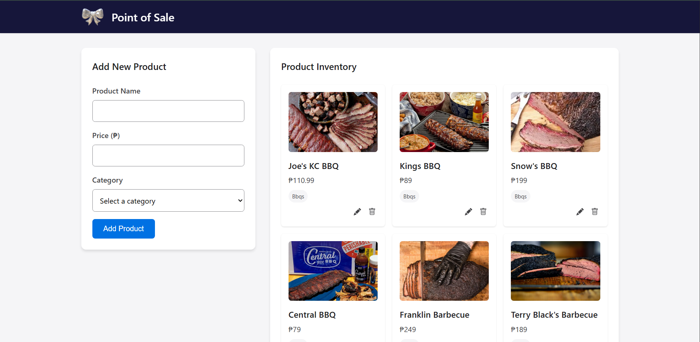

# Restaurant POS System

A small-scale restaurant Point of Sale (POS) system designed to streamline food ordering and kitchen operations. It includes customer, kitchen, and admin-facing interfaces, and integrates with a free public food menu API.

## Features

- **Customer Interface**: Landing page where guests enter their table number and party size. Displays categorized menu items and a live summary of their order.
- **Kitchen Interface**: Protected page showing real-time order statuses (Pending, Preparing, Ready, Completed). Requires authentication (access code).
- **Admin Interface**: Protected page showing product inventory with the ability to add new items. Requires separate authentication (access code).
- **Local Storage Usage**: Stores menu categories, products, and customer orders for performance optimization.

## Technologies Used

- **Frontend**: HTML, CSS, Javascript
- **Authentication**: Simple fixed-credential login for protected routes
- **Storage**: Browser Local Storage for caching and order persistence

## API Integration

- **Public Food Menu API**: [SBigz/free-food-menus-api](https://github.com/SBigz/free-food-menus-api)

  - Used to fetch food categories and product lists.
  - Data is initially fetched and stored in Local Storage to minimize repeated network requests.

## Getting Started

1. Clone the repository:

   ```bash
   git clone https://github.com/clicarte/finals.git
   cd finals
   ```

2. Open the `index.html` file in your browser, or use a simple HTTP server:

   ```bash
   npx serve
   ```

3. Open the application in your browser:

   ```arduino
   http://localhost:3000
   ```

4. View protected routes by manually inputting the URL

   **Kitchen-Facing**

   ```arduino
   http://localhost:3000/kitchen
   ```

   **Admin-Facing**

   ```arduino
   http://localhost:3000/admin
   ```

## Special Instructions & Known Bugs

- Fixed credentials must be hardcoded (for demonstration purposes only).
- Local Storage should be cleared between sessions to avoid stale order data.
- No backend or database integration — all data persistence is browser-local.
- Real-time updates between customer and kitchen views require page refresh unless further enhancements (e.g., WebSocket) are implemented.

## Developers

- Carol Marie Joyce M. Licarte
- Justin Gabriel Sausa

## Screenshots



